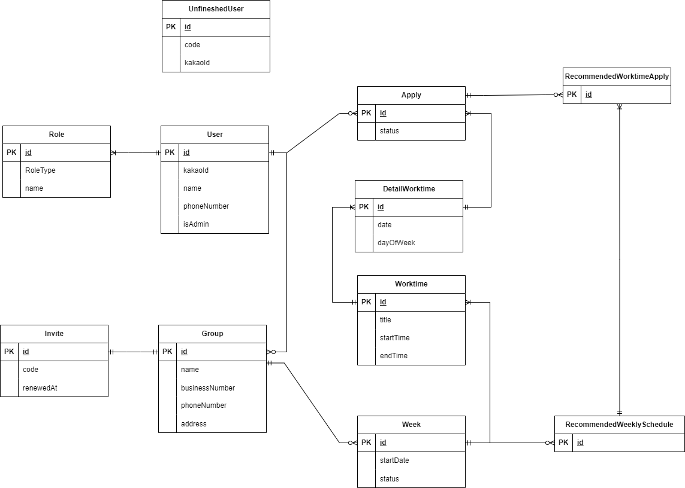

## 프로젝트 설명

####

영화관, 패스트푸드 등의 업장에서는 `스케줄 근무`를 시행합니다. 알바생들은 고정된 요일에 근무하지 않고, 근무 가능한 시간을 고려하여 매주 `스케줄`을 바탕으로 근무하게 됩니다.

매니저는 모든 알바생들의 근무 가능 시간을 텍스트로 수집하고, 이를 엑셀을 통해 취합합니다. 이 수동적인 작업은 시간, 노력이 많이 요구됩니다. 그래서 `자동화된 스케줄링` 서비스에 대한 니즈를 파악하였고, 저희 1조가 `스케줄, 알빠임?` 서비스를 개발하게 되었습니다.

#### 매니저라면?

1. `알빠임?`이 스케줄을 짜줘요! 자동 스케줄링 기능
   - 매주, 알바생이 필요한 `시간/인원`을 설정하여 스케줄을 세부적으로 `모집`할 수 있어요.
   - 알바생들이 스케줄을 신청했다면, 실시간으로 `신청 현황`을 확인할 수 있어요.
   - `알빠임?`만의 `스케줄링 알고리즘`을 통해 추천된 스케줄을 확인하고, 확정하여 공유할 수 있어요.

#### 알바생이라면?

1. 빠르고 간편한 내 스케줄 확인!

   - `달력 바탕의 UI`로 스케줄을 빠르고 간편하게 확인할 수 있어요.

2. 대타를 구하기 편해요!
   - 다른 알바생들이 언제 스케줄을 신청했는지 확인할 수 있어요. `대타`를 구할 때 분명 도움이 될 거예요!

## 사용 방법

프로젝트를 어떻게 사용하는지에 대한 설명을 적어주세요.

## 주요 기능

프로젝트의 주요 기능에 대한 설명을 적어주세요.

## 주요 문서 링크

- [API 문서](링크를_넣어주세요)
- [Error 처리 문서](링크를_넣어주세요)

## ERD

## 프레임워크/라이브러리

- Spring Boot
- Spring Data JPA
- Spring Boot Starter Security
- Spring Security Test
- Springfox
- JJwt
- Apache HttpClient
- Lombok
- H2 Database
- MariaDB Java Client
- Commons IO
- Commons Text

## 그라운드 룰

### 커밋 컨벤션

- feat : 새로운 기능에 대한 커밋
- fix : 버그 수정에 대한 커밋
- refactor : 코드 리펙토링에 대한 커밋
- docs : 문서 수정에 대한 커밋
- test : 테스트 코드 수정에 대한 커밋
- chore : 자잘한 수정에 대한 커밋(오타)
- build : 빌드 관련 파일에 대한 커밋
- move : 파일 이동에 관한 커밋
- rename : 파일이름 변경에 관한 커밋
- delete : 파일삭제 에 관한 커밋
- config : application.yml 파일에 대한 수정
- style : 코드 컨벤션 및 별도 코드 스타일 수정

### 코딩 컨벤션(스타일)

- [네이버 코딩 컨벤션](https://naver.github.io/hackday-conventions-java/) 사용중

### 작업 프로세스

1. issue 작성
2. 브랜치 생성
3. issue 해결
4. pull main
5. pull request
6. 테크리더 검토이후 merge

### 브랜치 네이밍

(feat, config, build, bug)/[세부 작업 내용]#[issue 번호]

### 이슈, PR 템플릿

이슈, 버그, PR에 대해서 공통양식을 작성하여 관리함  
실수로 main에 push를 방지하기 위해서 CODE-OWNER를 적용하여 merge되는 것을 방지

### 디렉토리 구조

도메인 중심의 디렉토리 구조로 하나의 도메인에 컨트롤러, 서비스, 레포지토리, 엔티티를 담고 있습니다.  
유틸의 경우 유틸 디렉토리에 역할별로 분류하여 저장하고 있습니다. 보안, 외부 API, 에러 핸들링 등을 관리중입니다.

## 주안점

### 보안

외부로부터의 악의적 접근을 차단하기 위해서 여러가지 보안사항들을 검토했습니다.  
웹 서비스를 대상으로 자주 사용되는 공격들을 위주로 보안점검을 했고, 보안사항들이 제대로 작동하는지 체크하면서 적용했습니다.

| 제목          | 내용                               | 조치                                                  |
| ------------- | ---------------------------------- | ----------------------------------------------------- |
| SQL Injection | SQL문의 취약점                     | 데이터 바인딩으로 안전함을 확인                       |
| XSS           | 문자 데이터에 악성 스크립트 주입   | 브라우저에서 검증하고, 문자열 데이터의 특수 문자 변환 |
| Spring4Shel   | Shell을 이용한 RCE 공격            | JDK, 프레임워크, Tomcat, POJO 를 모두 검사            |
| Role 부여     | 의도하지 않은 사용자의 서비스 접근 | API별 접근을 제어                                     |

### 서비스 분리

CRUD 중 R와 CUD를 분리할 필요가 있다고 느꼈습니다.  
Transactional이 적용된 메서드는 readOnly 가 true일때 나머지 CUD 에 대한 기능이 off 되므로 성능적인 향상을 이룰거라고 생각했습니다.  
그래서 CQRS를 도입하려 했지만 시간상 여유가 없어서 서비스만을 분리했습니다.

### 내부 에러 코드

같은 상태 코드라도 자세한 사유가 다를 수 있고, 이를 FE에서 별도로 처리해야 했습니다. 그래서 내부 상태 코드를 만들었고, 이를 위한 기준들을 세웠습니다.  
[에러코드 기준 문서](https://www.notion.so/error-978e4b88b09f4e20a487ec4904eddd67)  
[에러코드 조치 문서](https://www.notion.so/API-errorCode-b158aeae42b64c05b1edb3080ed96aed)

### API 요청 흐름(외부)

1. API 요청
   - 인증된 사용자인가(인증**[401]**, 인가**[403]**)
2. 요청 매칭
   - 요청 주소가 존재하는가**(400)**
     - 없는 주소를 요청 → 악의적 접근
   - 요청 양식이 적절한가**(400)**
     - GET : PathVariable 유효성
     - POST : Request Body 유효성
3. 요청 처리
   - 요청 값 자체가 의미상 유효한 요청인가(도메인상의 유효성)**(400)**
     - 그룹이 존재하는가, 스케줄을 작성한 적이 있는가 등
   - 접근하지 못하는 요청인데 접근했을 경우**(400)**
     - 그룹을 만든 매니저가 다시 그룹을 만든다면 악의적 접근
   - 내부 로직에서 에러가 발생하는가**(500)**
     - 내부 알고리즘
     - 데이터 처리(저장, 삭제)

## API 에러 코드

1. 1만번대
   - 0천번대(통신상에러, 500, 400번대 에러)알 수 없는 에러(500)
   - 1천번대(**비즈니스 로직**, 404번대 에러는 400으로 처리)
     - 파라미터 오류 : selectedDate 에 확정된 스케줄이 없을 때
     - 파라미터 오류 : startWeekDate 가 모집 중인 주가 아닐때
   - 알 수 없는 오류
   -
   - 요청 값 에러(400)
   - get 계열 요청 주소 양식 오류
   - post 계열 요청 값 오류
   - 등록된 회원이 아님(404)
   - 외부 서버 오류(500)
2. 2만번대
   - 0천번대(중복, 400)
     - 이미 가입된 ID
     - 이미 그룹이 있을때
     - 이미 스케줄(객체)을 만들었을때
     - 초대장으로 그룹을 찾을 수 없을때
     - 이미 마감을 했다
   - 1천번대(인증인가, 401 or 403) 접근여지가 없는데 접근을 했다
     - 인증(401)
     - 인가(403)
     - 요청 주소 오류
     - 초대장이 만료되었을 때
     - 접근 권한 : 소속 그룹이 없을 때
     - 접근 권한 : 그룹에 멤버가 본인뿐일 때
     - 해당 유저 ID를 찾을 수 없을때
     - 접근 권한 : 유저 타입 불일치 (알바생이 매니저 API 요청)
     - 접근 권한 : 유저 타입 불일치 (매니저가 알바생 API 요청)

### 배포 형태

배포 형태에 관한 설명을 적어주세요.

### 스케줄 알고리즘

신청한 스케줄을 우선순위를 기준으로 나열하여 DFS 방식으로 할당했습니다.  
우선순위의 기준은 필요한 인원수-지원한 인원수 입니다.  
스케줄을 채우지 못할 확률이 높은 스케줄부터 할당하는 방식으로 알고리즘을 작성했습니다.

## 배포 링크

[배포 링크](https://kf52b6fc37489a.user-app.krampoline.com/)

## 반대편 repo

[반대편 repo](링크를_넣어주세요)

## 전체 스트럭쳐

전체 스트럭쳐에 대한 설명을 적어주세요.
